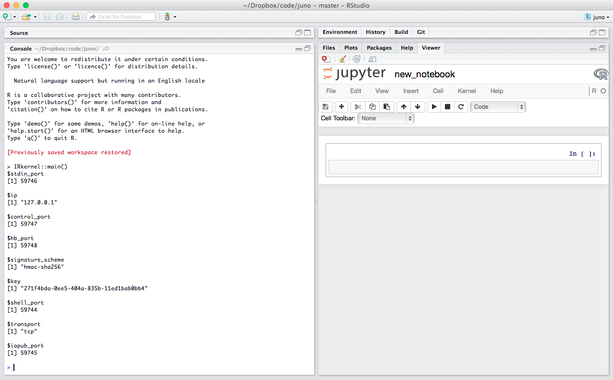

#juno: experimental rstudio/knitr/jupyter notebook mashups

> *NASA's [spacecraft Juno](https://www.nasa.gov/mission_pages/juno/spacecraft/index.html)
is slated to arrive at the planet Jupiter on July 4, 2016.*

**juno** is an experimental package with utilities to incorporate the
[jupyter notebook](http://jupyter.org/) into RStudio and Rmarkdown workflows.
Right now it has functions for two things:

-   Launching and viewing a Jupyter notebook server from within R and Rstudio
-   Converting between knitr documents and jupyter notbooks.

Everything here is super experimental and unstable. I have tried this only on OSX,
and it almost certainly won't work on Windows because of the way I use `system()`.
The Jupyter R kernel has just been released,
and the notebook itself is currently undergoing heavy development as the IPython
project splits its codebase into IPython and the language-agnostic notebook.

Comments, issues, pull requests most welcome!

# Install

You need some system dependencies to get this going. Here are the links to the
install instructions.

-   [IPython](http://ipython.org/install.html) 3.0 or later.
-   The [IPython R Kernel](https://irkernel.github.io/)

To install **juno**, run

    install.packages('devtools')
    library(devtools)
    install_github('noamross/juno')
    
# Usage

## Server

To launch a Jupyter server notebook, run

    library(juno)
    jupyter_server('new_notebook.ipynb')
    
If everything is installed properly, a new server will be
launched and an R notebook will be created.  If the notebook already exists, it will
be opened. If you use RStudio, you should see something like this:

Otherwise the notebook will be launched in a browser (using `browseURL()`).

The notebook will be saved at whatever path you specified in the (current working directory by default).
You can specify the server working directory, port, and IP in `jupyter_server()`, as well.  See `?jupyter_server`.

`jupyter_server()` also returns the URL of your notebook. It also should only
allow one server to run per R session. If you launch a new server with different
options, it will shut the current one down. If you open a new notebook, it will
use the current server/kernel if it can.

Of course, all that is happening here is that `jupyter_server()` launches
the server using `system()` and then passes the notebook URL to `rstudioapi::viewer()`.
So you can roll your own if you want.

You can also `kill_jupyter_server()`.

## Conversions

**juno** also has `rmd_to_jupyter(infile, outfile)` and `jupyter_to_rmd(infile, outfile)`,
which convert between R Markdown documents and Jupyter Notebooks.  The hope is that
these can be fully two-way conversions. Metadata at the document and code chunk level
are preserved in both directions.

Notebook *outputs* are not preserved in conversion to Rmd.

Python kernel notebooks will be converted to R Markdown documents with python engines, though
these will not be entirely functional as knitr does not maintain Python environments between
code chunks. In the other direction,
the kernel will be selected based on the engine of the first code chunk.

Right now metedata for *markdown* cells in jupyter notebook are stored as HTML
comments in R Markdown documents, but this conversion isn't two way-yet. If you
have multiple, consecutive markdown cells in a notebook, they will be merged into
a single markdown cell in the journey from notebook to R markdown and back.  Empty markdown cells
also will disappear.

